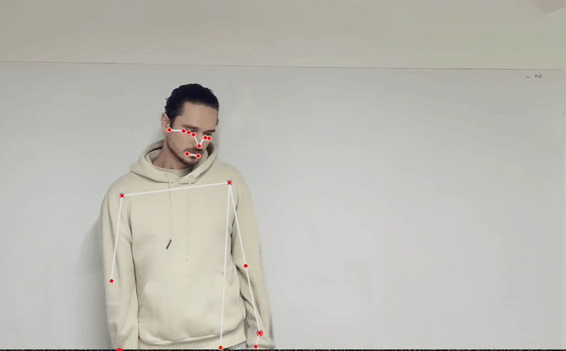
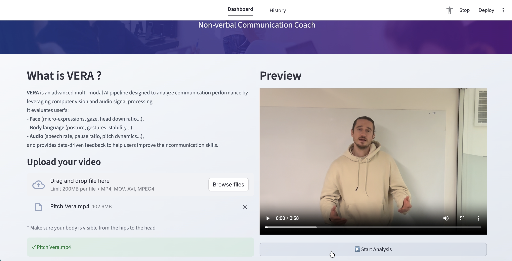
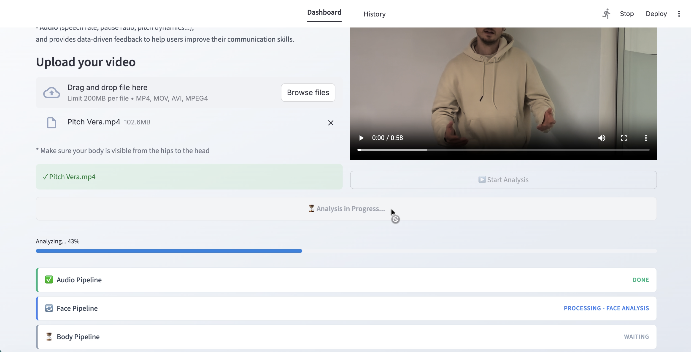
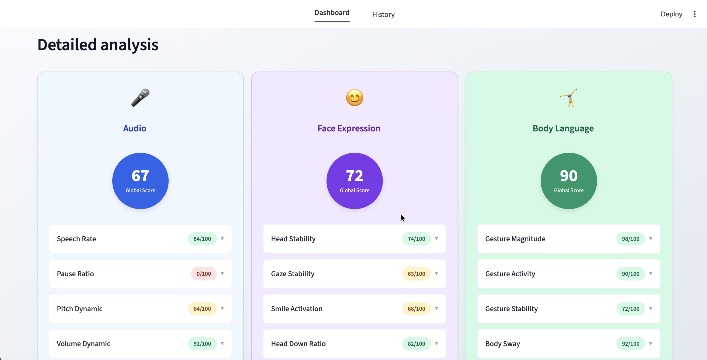
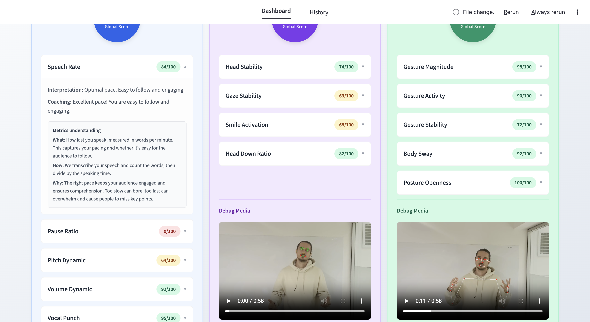
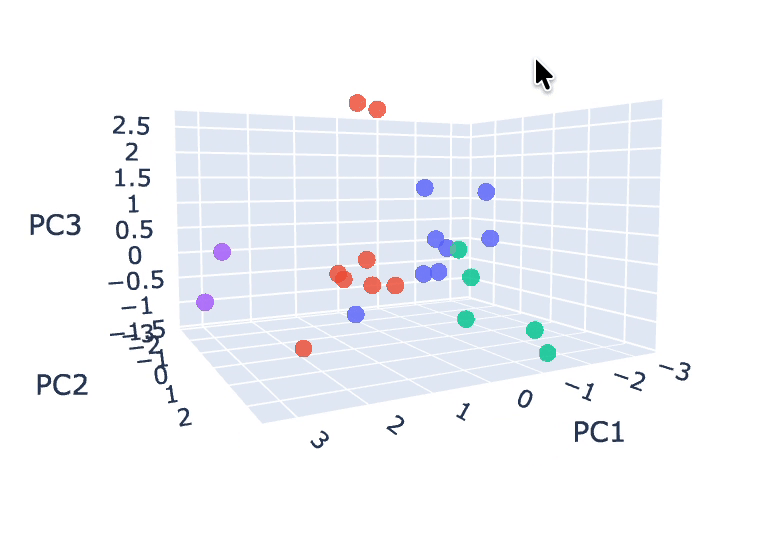
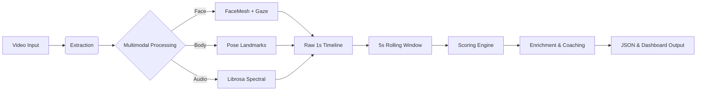

# VERA (Voice - Expression & Reaction Analysis)


**VERA** is an advanced multi-modal AI pipeline designed to analyze communication performance. It processes video input to evaluate **Face** (micro-expressions, gaze...), **Body** (posture, gestures...), and **Audio** (tonality, pacing...) metrics. By leveraging computer vision and audio signal processing, VERA provides objective, data-driven feedback to help users improve their communication skills.

**Disclaimer:**
* VERA is a prototype and we recommend to not upload videos longer than **1 to 2 minutes** (e.g. elevator pitch).
* Some metrics are under fine-tuning and may not be as accurate as others.

## 🌟 Why VERA?

Public speaking and communication are critical soft skills for **Founders, Students, Executives...**. Yet, feedback is often subjective and scarce.

VERA solves this by providing:
*   **Scientific Objectivity:** Moving beyond "you look nervous" to "your gaze stability dropped by 20%".
*   **Holistic Feedback:** Analyzing not just what you say, but *how* you say it through your non-verbal communication (Face, Body, Voice).
*   **Automated Coaching:** offering actionable tips.

---

## 🚀 Key Features

*   **Multi-Modal Analysis:** Parallel processing of visual signals (using MediaPipe) and auditory signals (using Whisper and Librosa).
*   **14 Core Metrics:** Comprehensive tracking of engagement indicators (e.g., Gaze Stability, Gesture Magnitude, Vocal dynamic).
*   **Persona K-means Clustering:** Unsupervised ML that automatically assigns a "Communication Persona" based on high-dimensional metric clusters.
*   **Rich Visualization:** Generates debug videos with skeletal overlays to visualize exactly what the AI sees.

---

## 🎥 Showcase & Examples

### 🔍 Visual Intelligence
VERA sees what you can't. Our computer vision pipelines track micro-expressions and skeletal dynamics in real-time.

<div align="center">
  
  
  <p><i>Left: Mediapipe FaceMesh - 13 facial landmarks out of the 468 for Face analysis</i></p>
  <p><i>Right: MediapipeHolistic - 6 body landmarks out of the 33for Gesture Analysis</i></p>
</div>

### 📊 Interactive Dashboard
A minimal, high-impact dashboard gives you instant feedback on your communication skills.

<div align="center">
  
  <p><i>VERA Dashboard: Video upload</i></p>
</div>

<div align="center">
  
  <p><i>VERA Dashboard: Video analysis</i></p>
</div>

<div align="center">
  <br>
  
  <p><i>VERA Dashboard: Real-time analysis with global scoring</i></p>
</div>

<div align="center">
  <br>
  
  <p><i>Deep Dive: Granular metrics and actionable coaching tips</i></p>
</div>

<div align="center">
  <br>
  
  <p><i>History Page to revisit your past coaching sessions</i></p>
</div>

### K-means Clustering - unsupervised ML
Unsupervised ML that automatically assigns a "Communication Persona" based on raw high-dimensional extracted metrics. e.g:

<div align="center">
  <br>
  
  <p><i>3D PCA projection (Explained variance: 80.4%)</br>7 features – K=4 – n_init = 50 – run 30 times
</i></p>
</div>


---

## 📂 Project Structure

```text
VERA/
├── data/
│   ├── clustering_dataset/      # ML dataset for persona clustering
│   ├── processed/               # Pipeline output for CLI runs
│   └── raw/                     # Input videos
├── front-end/
│   ├── app.py                   # Streamlit Dashboard application
│   └── processed/               # Pipeline output for UI runs
├── notebooks/                   # Jupyter notebooks for experimentation & viz
├── reports/                     # Calibration manifests and analysis reports
├── src/
│   ├── analysis/                # Data enrichment, scoring, and prediction logic
│   ├── audio/                   # Audio extraction & processing (Librosa)
│   ├── body/                    # Body pose extraction (MediaPipe Pose)
│   ├── face/                    # Facial landmark extraction (MediaPipe FaceMesh)
│   ├── presentation/            # Result formatting and enrichment
│   ├── schemas/                 # JSON schemas (single source of truth for text)
│   ├── utils/                   # Shared utilities (IO, logging)
│   └── main.py                  # CLI Entry point & Orchestrator
└── README.md
```

---

## 🛠️ Installation

### Prerequisites
*   Python 3.10+
*   `ffmpeg` (Required for audio processing. Install via `brew install ffmpeg` on Mac or `apt install ffmpeg` on Linux).

### Setup

```bash
# Clone the repository
git clone https://github.com/WiwiC/VERA.git
cd VERA

# Create a virtual environment
python -m venv VERA-env
source VERA-env/bin/activate  # or VERA-env\Scripts\activate on Windows

# Install dependencies
pip install -r requirements.txt
```

---

## 💻 Usage

### 1. Run Analysis (CLI)
To analyze a single video file directly from the terminal:

```bash
python src/main.py <path/to/video.mp4>
```
*   **Output:** `data/processed/<video_filename>/`

### 2. Run Dashboard (UI)
To analyze videos and visualize results in the interactive dashboard:

```bash
streamlit run front-end/app.py
```
*   **Output:** `front-end/processed/<video_filename>/`

### 3. Input specifications
*   **File Types:** `.mp4` or `.MOV`.
*   **Duration:** Recommended **1 to 2 minutes** (e.g., elevator pitch).
    *   *Note: This is a prototype. A 1 min video takes ~2 min to process.*
*   **Camera Setup:**
    *   Front-facing camera.
    *   Camera at eye level.
    *   **Framing:** Ensure body is visible from **hips to head** to capture hand gestures.

---

## 📊 Metrics Guide

All text definitions, coaching tips, and interpretation labels are centralized in:
> **`src/schemas/metrics_spec.json`**

**Important:** This file is the "Source of Truth". It should be kept in synchronization with the numerical thresholds defined in `src/*/config.py`.

| Module | Metric | Description |
| :--- | :--- | :--- |
| **Face** | `head_stability` | Measures head steadiness (nodding vs. frozen). |
| **Face** | `gaze_stability` | Tracks eye contact focus and consistency. |
| **Face** | `smile_activation` | Measures smile intensity and frequency. |
| **Face** | `head_down_ratio` | Percentage of time looking down. |
| **Body** | `gesture_magnitude` | Expansiveness/size of hand gestures. |
| **Body** | `gesture_activity` | Speed and frequency of gestures. |
| **Body** | `gesture_stability` | Smoothness vs. jitteriness of movement. |
| **Body** | `body_sway` | Torso movement (rocking vs. grounded). |
| **Body** | `posture_openness` | Shoulder/chest openness. |
| **Audio** | `speech_rate` | Words per minute (WPM). |
| **Audio** | `pause_ratio` | Ratio of silence to speech. |
| **Audio** | `pitch_dynamic` | Tonal variation (avoiding monotone). |
| **Audio** | `volume_dynamic` | Loudness variation. |
| **Audio** | `vocal_punch` | Peak volume clarity and emphasis. |

---

## 🧪 Calibration Process

To ensure scientific rigor, VERA uses a calibration system to fine-tune scoring thresholds.

### How it works
1.  **Labeled Data:** We maintained a `reports/calibration_manifest.csv` containing IDs of videos (contained in data/raw folder) labeled by human (scores 0-100).
2.  **Analysis Scripts:** Scripts in `src/analysis/` (e.g., `generate_calibration_report.py`) compare VERA's outputs results against these human labels.
3.  **Threshold Tuning:** We use `final_calibration_search.py` to find the optimal parabolic thresholds that maximize correlation with human judgment.

### Workflow
*   **Add Labeled Videos:** Update `calibration_manifest.csv` with new video IDs and manual labels. (For labels list check: **`src/schemas/metrics_spec.json`**)
*   **Run Analysis:** Execute `python src/analysis/generate_calibration_report.py` to see current performance.
*   **Update Thresholds:** Adjust `BASELINE_*` constants in `src/*/config.py` based on the report.
*   **Validate:** Re-run the report to confirm Spearman correlation improvements.

---

## 🧠 Unsupervised Clustering (ML)

VERA uses **K-means clustering** to identify "Communication Personas" without explicit labels.

*   **Dataset:** `data/clustering_dataset/master_vector_data_set.csv`. This file accumulates feature vectors from all processed videos.
*   **Mechanism:**
    1.  Each analysis extracts a rawhigh-dimensional feature vector (all 14 metrics).
    2.  This vector is added to the master dataset.
    3.  We run K-Means to find natural groupings.
    4.  New users are assigned to the nearest cluster center to predict their persona.

---

## 🏗️ Architecture

The pipeline follows a linear data flow:



---

## 📈 Accuracy & Scientific Notes

We prioritize metrics that show strong correlation with communication effectiveness. Based on our latest calibration:

*   **Strong Signals:** `speech_rate`, `gaze_stability`, `gesture_magnitude` show high Spearman correlation (>0.7) with human expertise.
*   **Calibration:** The tiered parabolic scoring helps normalize differences between webcam hardware.

**Note:** Based on our last calibration report:

1. **Global accuracy:**

| Metric | N | Exact Match (%) | Within ±1 Bucket (%) |
| :--- | :---: | :---: | :---: |
| **gesture_activity** | 322 | 78.3% | **100.0%** |
| **speech_rate** | 322 | 78.3% | **95.7%** |
| **posture_openness** | 322 | 52.2% | **91.3%** |
| **gesture_magnitude** | 322 | 39.1% | 87.0% |
| **body_sway** | 322 | 21.7% | 87.0% |
| **gesture_stability** | 322 | 39.1% | 87.0% |
| **head_stability** | 322 | 26.1% | 78.3% |
| **pause_ratio** | 322 | 34.8% | 78.3% |
| **gaze_stability** | 322 | 17.4% | 78.3% |
| **pitch_dynamic** | 322 | 39.1% | 73.9% |
| **volume_dynamic** | 322 | 8.7% | 73.9% |
| **smile_activation** | 322 | 13.0% | 69.6% |
| **vocal_punch** | 322 | 34.8% | 65.2% |
| **head_down_ratio** | 322 | 0.0% | 65.2% |
| **AVERAGE** | **322** | **34.5%** | **80.8%** |

*(Calibration Report 2025-12-11).*

2. **Accuracy per metric:**

- Strong, reliable metrics (high exact AND high within-1 step):

* gesture_activity
* speech_rate
* posture_openness
* gesture_magnitude
* body_sway
* gesture_stability

- Moderately noisy but still directionally useful:

* head_stability
* gaze_stability
* pause_ratio
* pitch_dynamic
* volume_dynamic

- Noisiest / Further calibration needed:

* smile_activation
* vocal_punch
* head_down_ratio

---

## ❓ Troubleshooting

| Issue | Solution |
| :--- | :--- |
| **`ffmpeg` not installed** | Install FFmpeg system-wide. Audio processing will fail without it. |
| **MediaPipe failing** | Ensure good lighting and that the face is fully visible/unobstructed. Zoom your video if needed but try to keep the body visible from hips to head. Debugged videos are here to see if everything was correctly captured |
| **Missing folders** | Run `python src/main.py` once to auto-generate `data/processed`. |
| **CUDA error** | VERA defaults to CPU to ensure compatibility. If verifying CUDA, check torch version. |

---

## 🔒 Privacy & Security

*   **Local Processing:** All analysis happens locally on your machine.
*   **No Cloud Storage:** Videos are not uploaded to any external server.
*   **User Control:** You retain full ownership of your data and bio-metric information.
*   **No Tracking:** No third-party analytics or tracking pixels are used.

---

## 📜 License

MIT License
Copyright (c) 2025 WiwiC

---

## ✍️ Credits

*   **Author:** William Chalons
*   **Core Libraries:**
    *   [MediaPipe](https://developers.google.com/mediapipe) (Vision)
    *   [Librosa](https://librosa.org/) (Audio)
    *   [Streamlit](https://streamlit.io/) (UI)
    *   [Pandas/Numpy](https://pandas.pydata.org/) (Data)
    *   [Scikit-learn](https://scikit-learn.org/stable/) (Clustering)
